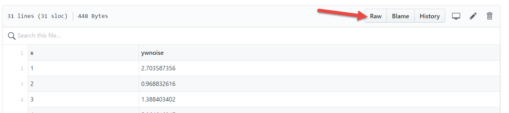
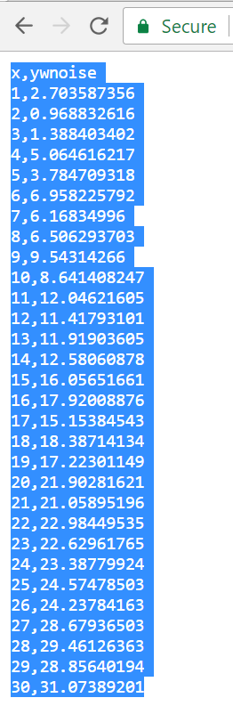
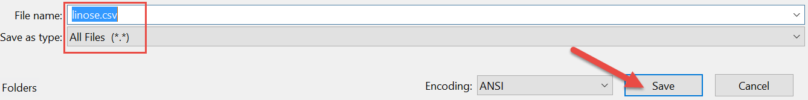
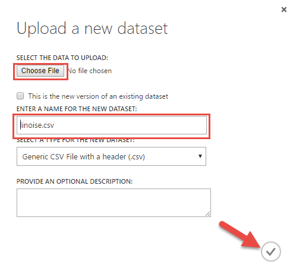
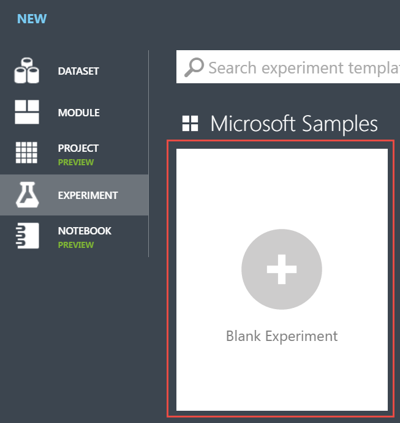
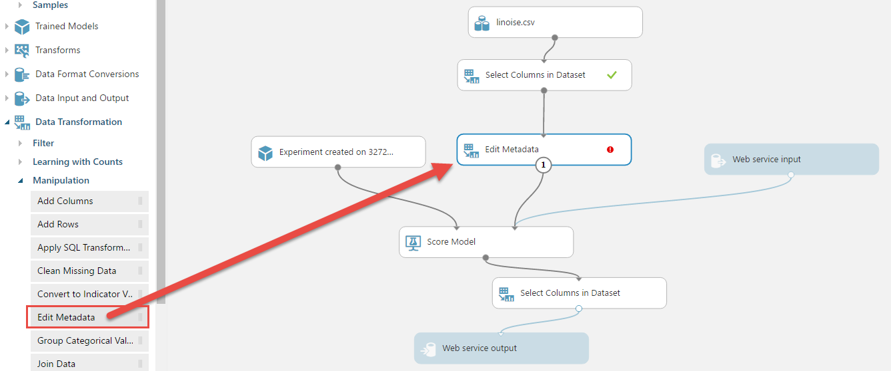
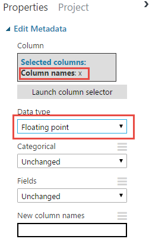

# Azure Machine Learning Basics

## 1.1. Overview
This lab is a walkthrough demonstrating how to create an Azure Machine Learning experiment, train the machine learning model, and integrate it into an application. You will learn how to upload datasets, train a linear regression model, publish the model as a web service, and consume the web service from a sample console application. This application will send input parameters and retrieve predicted results as JSON output values. 

### 1.1.1. Objectives
This lab aims to demonstrate how to train an Azure Machine Learning model, publish it as a web service, and consume it though a console application.    

## 1.2. Working with Azure Machine Learning Models
In this session we will develop a Machine Learning experiment to create a Machine Learning model. We will train the model with the provided dataset so that it can predict values of interest. These values may or may not be contained in the dataset already. In the dataset we will use, there are x values from 1 to 30 and corresponding ywnoise values (y values with noise). After training the model on the x and y values we will be able to use the model to predict ywnoise values based upon inputed x values.

### 1.2.1. Upload a dataset  
1.  Navigate to the data file in the [data folder](./Data). Click on the csv then click "Raw".  


2. Copy and paste the CSV data into notepad.   
 

3.  Save the file as a CSV file.  



4. Now that you have saved the CSV file, click the following link to open your [Azure Machine Learning Workspace.](https://studio.azureml.net/?selectAccess=true&o=1)   

5. Click **NEW** on the bottom left of the page. 


6. Click **DATASET** then choose **FROM LOCAL FILE**.


7. Navigate to the the file "*linoise.csv*". Feel free to change the name of the dataset or enter a description. Then click the checkmark button on the bottom right corner to upload the file.



### 1.2.2. Training a model
For this lab, we will walk through very simple Machine Learning solutions. There are many ways this lab can be extended to support more data manipulation, cleaning, splitting, etc. however we will focus on the fundamentals.  

1. Create a blank experiment in Azure Machine Learning Studio.  


2. From the module toolbox, under **Saved Datasets**, drag and drop the dataset “*linoise.csv*” that we just uploaded from “**Saved Datasets**” **->** “**My Datasets**”.  

  

3. From the module toolbox, drag and drop a *Linear Regression* module that is under the “**Machine Learning**" **->** "**Initialize Model**" **->** "**Linear Regression**” node path.

  

4. From the module toolbox, drag and drop a *Train Model* module that is under the “**Machine Learning**” **->** “**Train**” node path.

  

5. Click on the output port of the *Linear Regression* module then drag the cursor a little bit to see the possible input ports. Acceptable input ports of any available module become green; non-acceptable input ports become red. Note, there is no color change on the output ports of *linoise.csv* and *Train Model* module’s output ports because they don’t accept any input.

   

6. As mentioned in the previous step, every input port has a specific input type so it is not possible to connect modules that are incompatible. Once you complete the connections, the experiment should look like the image below. Note, the *Train Model* module has a warning icon stating that a value is required.

  

7. Click the *Train Model* module then in the properties window, click on the “**Launch column selector**” button.

  

8. In the pop-up window, select the *ywnoise* column as the label column then press the checkmark button on the bottom right corner. This instructs the model to learn to predict the *ywnoise* column.  

  

9. The final step is to **RUN** the experiment so the data will flow through the modules to train the machine learning model. After clicking the **RUN** button, wait for a few seconds while execution completes. Execution of any experiment will complete with either success or an error. After the model has completed you should see a “*Finished Running*” message with a green checkmark on the top right corner of the experiment canvas.  

  

10. After a successful execution, you can click on the output ports of the modules and visualize the output data, but they may not make much sense because the outputs here are statistical model training related parameters. To benefit from this “run” or trained model/experiment, we need to publish it as a web service. This will create public input and output ports that we can connect to. As we will see, we can consume the service by sending inputs (in this case “*x*” values) and get corresponding output (“*ywnoise*”) values through an application.  

### 1.2.3. Publishing a trained model as web service
1. In order to continue, you must complete a successful *RUN* of the experiment resulting in a “*Finished running*” notification with a green checkmark.  

2. Click “**Set Up Web Service**” on the command bar then click “**Predictive Web Service [Recommended]**” on the pop-up menu.  

  

3. After few seconds of animated changes to your experiment you will have a new tab in the canvas. We will continue working on the new “**Predictive experiment**” tab on the canvas.

  

4. It's worth noting that we can optionally change the experiment's name by double clicking the title and editing it.

5. On this new predictive experiment tab, you will notice some modules were removed and the following four modules were added:  
    -	*Experiment created on...* module
    -	*Score Model* module
    -	*Web service input* module
    -	*Web service output* module  

    Later on we will make some changes on this new design, but let’s publish it as it is.

6. Before publishing the model as a web service, the experiment must be ran so possible edits can be validated. Click **RUN** in the “*Predictive experiment*” tab.  

7. Click on the **Deploy Web Service** button on the command bar.

  

8. After few seconds, you will be forwarded to web services page that shows the newly created web service for your experiment.

  

9. On this new web service page, you can click on the blue **Test** button to start using the trained model. Clicking this button will launch a popup window that has a form with editable input parameters for the web service.

  

10. You'll notice there is an input box for “*ywnoise*” data but no matter what value you type in this field, it will not affect the result of the service call that is the value we are trying to predict. Now, type any value (i.e., 578) in the “*x*” input field but keep the “ywnoise” as it is. Then click the checkmark button at the bottom right corner.  

  

11. After a few seconds you will see a notification bar at the bottom of the screen with a *Details* link on it. Click on the **Details** link.

  

12. In the details, the output of the web service is shown in a JSON data format. You can see the input parameters “x” and “ywnoise” (note, "ywnoise" is an ignored input value) and the output value “*Scored Labels*” in this window. If you'd like, you can check the Machine Learning model’s predictions for different input parameters.

  

### 1.2.4. Removing redundant input and output parameters from a Web Service
1. Switch to the **Configuration** tab in the web service details page.

  

2. Again, you will notice the redundant input and output parameter “*ywnoise*” both in the input and output schema, and “*x*” in output schema.  

  

3. To remove these redundant fields, switch to the “*Experiments*” page, open the experiment, and switch to the “*Predictive Experiment*”.  

4. Drag and drop *two* **Select Columns in Dataset** modules from “**Data Transformation**” **->** “**Manipulation**” **->** “**Select Columns in Dataset**” node path. Connect one “Select Columns in Dataset” module from the “linoise.csv” module, then the other from the **Score Model** module as shown below.  

5. Reconnect the input/output ports from “linoise.csv” to “Score Model” and from “Score Model” to “Web service output” modules by adding the “Select Columns in Dataset” modules between the modules as shown below.

  

6. Click on the first “Select Columns in Dataset” module and then click the **Launch column selector** button on the properties window.  

7. Select just the “*x*” column in the pop-up window.

  

8. Now, do the same for the second “Select Columns in Dataset” module using the “Scored Labels” column as the output (instead of the "*x"* column).

  

9. Press **RUN** to execute the experiment with its recent updates.  

  

10. Click on **Deploy Web Service** button.  

  

11. In the confirmation message, click on the “*Yes*” to overwrite the old web service.

  

12. Once again the web service is published and automatically switched to the Dashboard page. Click on the **Test** button. Now, you will only see  the “*x*” parameter as an input. Enter any numeric input value and press the checkmark button at the bottom right corner.

  

13. After a few seconds, the output of the web service will become available in the notification bar at the bottom of the page. Click on the **Details** link.

  

14. Now, you will only see the “*Scored Label*” as a JSON output. Here we have a web service working as we would expect.

  

### 1.2.5. Consuming the Machine Learning Web Service in a C# application
In the previous section we tested our new Machine Learning web service through the web portal. Now, we will integrate the web service into a C# console application.  

1. Open Visual Studio 2017 or Visual Studio 2015.

2. Create a new project.

 

3. Select **C# Console Application** and click **OK** to create a blank application template.  


4. In the Solution Explorer window, right click on the project name “**ConsoleApplication1**” (if you haven’t changed the default project name) then select “**Manage NuGet Packages…**” in the pop-up menu.  


5. The NuGet Package Manager window will open in a new tab. Type “*Microsoft.AspNet.WebApi.Client*” in the search box then click the **Install** button to have this package installed in our console application. This package is used for network content negotiation with JSON.


6. Once the package has been installed, switch back to the **Program.cs** file tab, or double click on the **Program.cs** file name in the Solution Explorer window. Here we will type our C# commands to call the web service and show the results.  

7. The C# code that we will write in Program.cs is actually already in the Azure Machine Learning Studio. Switch back to the Web Service page in Azure Machine Learning Studio, where we made the tests in the previous section. On this page, click on the “REQUEST/RESPONSE” link under the “Default Endpoint” section. 


8. A new web page called "Request Response API Documentation" will open. Scroll to the section labeled “Sample Code”. In the “Sample Code” section, the C# tab is selected by default. Click on the “Select sample code” button on the top right corner of this section then copy the code.


9. Paste the code over all other content in “Program.cs” in Visual Studio.


10. Now we need to make few simple changes to that code. Find the line that starts with:

    ```c#
    const string apiKey = "abc123";
    ```  
    
    On this line we need to replace “*abc123*” with another string. This will be like a password to access our web service. Without this key/password, it is not possible to call our web service, otherwise anyone could run up your Azure bill by calling the service over and over. 

11. Go back to the Azure Machine Learning web service page and copy the secret “API key”. Replace the above “*abc123*” string with the Key.


12. Update the code so we will send three “*x*” values: -93, 15, and 174. To do so, go to the code line that starts with:  
    ```c#
    Values = new string[,] {  { "0" },  { "0" },  }
    ```  
    and replace it with:  
    
    ```c#
    Values = new string[,] {  { "-93" },  { "15" }, { "174" }, }


    ```  

15. Run the updated code. For the values: -93, 15, and 174 to see the corresponding 3 outputs coming from the web service:

  

### 1.2.6. Input data type of a web service
In the previous example, we used integer data types as input values. Now we'll look at float data types.

1. Either using the web based test form or the C# Console Application, enter a floating point value as an input. Press the checkmark button on the bottom right corner.

  

2. After few seconds you will get an error message in the notification area, telling you that the input value provided is not in the correct data format.

  

3. To overcome this error, drop an **Edit Metadata** module from the “**Data Transformation**” **->** “**Manipulation**” node path. Then connect this *Edit Metadata* module between the *Select Columns in Dataset* module and the *Score Model* module.

  

4. Switch to the properties window of the **Edit Metadata** module. Click the “*Launch Column Selector*” button, select “*x*” column then click on the check mark button at the bottom right corner.

  

5. Again, in the *Properties* window, change the “*Data type*” property to “*Floating point*”

  

6. **RUN** the experiment then publish it again. Now you can use it with floating point input values.  

## 1.3. Conclusion  
You have successfully built, deployed, and consumed a Machine Learning solution using Azure Machine Learning and Visual Studio!
