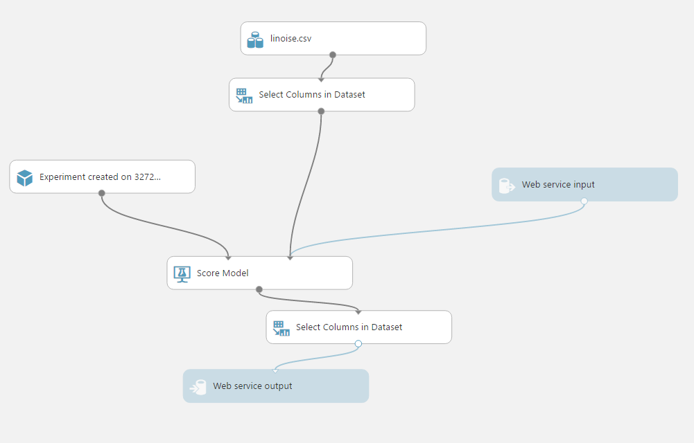
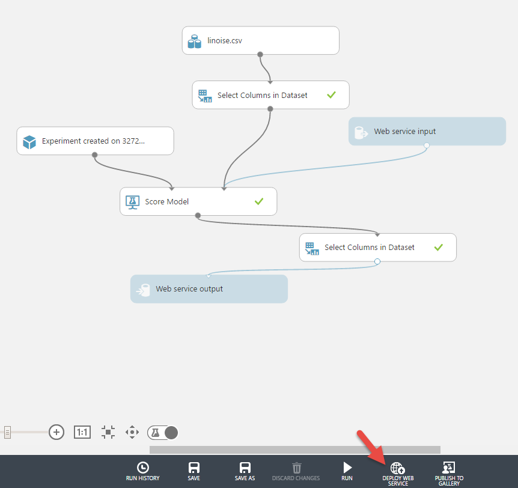
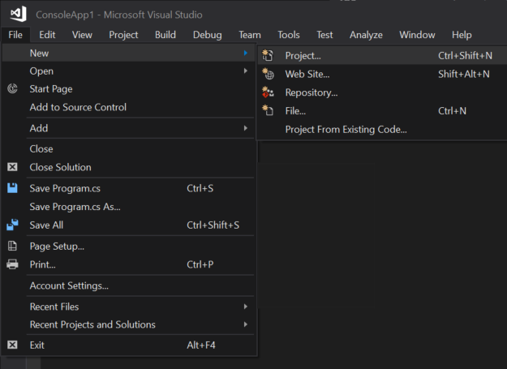
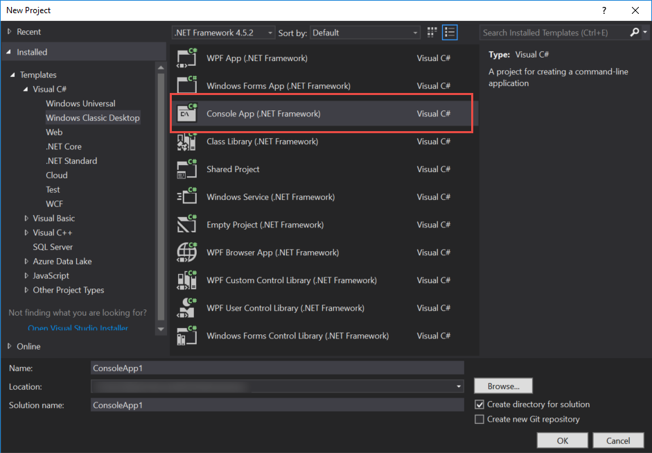
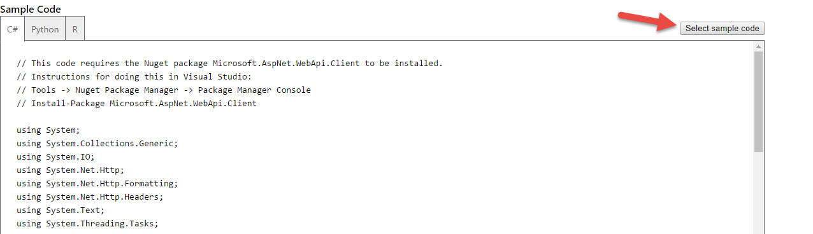

# Develop and Consume Azure Machine Learning Models
## 1.1. Overview
This lab is a walk through of how to create an Azure Machine Learning experiment, to train a model, and integrate it into an application. The first section shows how to upload a dataset, and the second section shows how to train a linear regression model. Then the trained model is published as a web service which is integrated into a sample console application. Accessing the web service through  endpoints. The sample application sends input parameters and retrieves predicted correspondences as an output value in JSON format. During this development, minor possible issues are also discussed and the ways to handle them mentioned.  

### 1.1.1. Objectives
This lab aims to demonstrate how to train an Azure Machine Learning model, publish it as a web service and consume it in a console application.    

## 1.2. Working with Azure Machine Learning Models
In this session we will develop a Machine Learning experiment to create an Machine Learning model. Idea is to train a Machine Learning model with the dataset, so we can let the model to predict values of interest that may be contained in the dataset or missing entirely from the dataset. In our dataset we have x values from 1 to 30 and their corresponding ywnoise values (y values with noise).  Using this dataset, we will train a model. In the future, if we want to learn the correspondence of a new x value such as 35, 200 or -40 etc. which is not sampled in the dataset, we will use the trained model to predict the corresponding ywnoise value.  

### 1.2.1. Upload a dataset
1. Click new on the bottom left of the page.  


2. Then click Dataset and choose from a local file.  


3. Navigate to the the file "linoise.csv". Feel free to change the name of the dataset or enter a description. Then click the checkmark button on the bottom right corner to upload the file.  


### 1.2.2. Training a model
For this lab, we walk through very simple Machine Learning solutions. There are many ways this lab can be extended to support more data manipulation, cleaning, splitting etc.  

1. Create a blank experiment in Azure Machine Learning Studio. From the module toolbox, under saved datasets, drag and drop the dataset “linoise.csv” that we just uploaded from “Saved Datasets” -> “My Datasets”.  
  

2. From module toolbox, drag and drop a *Linear Regression* module that is under the “Machine Learning" -> "Initialize Model" -> "Linear Regression” node path.  
  

3. From module toolbox, drag and drop a *Train Model* module that is under the “Machine Learning" -> "Train” node path.  
  

4. Click on the *Train Model* module and continue with their default values.    

5. Click on the output port of *Linear Regression* module and drag the cursor a little bit. You will see while the possible input ports (possible input ports of any available module) become green, other, non-appropriate input ports become red. Also there is no color change on the output ports of *linoise.csv* and *Train Model* module’s output ports because they don’t accept any input.  
   

6. As mentioned in the previous step, every input port has specific input type and it is not possible to connect one’s output to any of the input ports of another’s. Once you complete the connections, experiment should look like in the below image. As you can see the *Train Model* module have a warning icon telling that a value required.  
  

7. Select the *Train Model* module and switch to its properties window then click on the “Launch column selector” button.  
  

8. In the pop-up window, select the ywnoise column as the label column then press the checkmark button on the bottom right corner.  
  
For the simplicity, we have two columns, “x” and “ywnoise”, in our input dataset. In this experiment, looking at the values in “x” column, we train our “Linear Regression” model with their labels/correspondence values on the “ywnoise” column. So the model will take any “x” value in the future and will predict the best possible “ywnoise” value. As summary, label column is the target column that we will predict its value.  

9. Final step is to “RUN” the experiment so the data will flow within the modules and our model will be trained. Just press the “RUN” button and wait for few seconds to have the execution complete. Execution of any experiment will complete with either success or with an error. You should see the “Finished Running” message with a green checkmark on the top right corner of the experiment canvas.  
  

10. After successful execution, what is the output? You can click on the output ports of the modules and visualize the output, but they will not help much as the output consist of more statistical, model training related parameters. To be able to benefit from this “run” or trained model/experiment, we need to publish it as a web service to create public Input/Output ports that can be connected from an application. Through that application we can consume the service by sending inputs (in this case “x” values) and get corresponding output (“ywnoise”) values.  

### 1.2.3. Publishing a trained model as web service
1. To continue with the next steps, first you must complete a successful “RUN” of the experiment and got the notification “Finished running” with a green checkmark as mentioned in the previous steps.  

2. Now before creating a web service out of the experiment, click “Set Up Web Service” on the command bar, then click on “Predictive Web Service [Recommended}” on the pop-up menu.  
  

3. After few seconds with some animation and change in our experiment you will have a new tab in the experiment canvas. Don’t worry your initial experiment design is not lost and automatically saved. You will notice the two version with two separate tabs on top of the canvas. We will continue working on the “Predictive experiment” tab on the canvas.  
  

4. Before continuing, lets change the experiment name which will make the rest of the process titles easier to read. Lets give the name “Lab04” to our experiment by double clicking the title and editing it.  
  

5. On this new predictive experiment tab, you will notice following four new module added to the experiment and some previous ones removed.  
    -	*Experiment created on 1272…* module
    -	*Score Model* module
    -	*Web service input* module
    -	*Web service output* module  

    Later on we will make some changes on this new design, but let’s publish it as it is.

6. Before publishing as a web service, the experiment must be run so possible edits can be validated. So we “RUN” it in the “Predictive experiment” tab.  

7. Finally click on the “Deploy Web Service” button on the command bar.  
  

8. After few seconds, you will be forwarded to web services page that shows the newly created web service for your experiment.  
  

9. On this new web service page, you can click on the blue “Test” button to start using the trained model. Clicking this button will launch a popup window that has a form with editable input parameters for the web service.  
  

10. You notice that there is an input box also for “ywnoise”. Idea was to provide any “x” value as an input and get the “ywnoise” value as an output. But this input form also have the output parameter as an input. Whatever value you typed in this output (ywnoise) field, it will not affect the result of the service call. So type any value i.e. 578 in the “x” input field, keep the “ywnoise” as it is then click the checkmark button on the bottom right corner.  
  

11. After few seconds you will see a notification bar at the bottom of the screen, with a “Details” link on it. Click on the “Details” link.  
  

12. In the details, the output of the WebService is shown in a JSON data format. You can see the input parameters “x” and “ywnoise” (which is not an input value actually) and the output value “Scored Labels” in this window. You can check the Machine Learning model’s reaction to different input parameters.   
  

### 1.2.4. Removing redundant input and output parameters from a Web Service
1. Switch to the “configuration” tab in the webservice details page.  
  

2. In the previous section or if you go to the configuration tab of the web service, you will notice the redundant input and output parameters such as “ywnoise” both in input and output schema, “x” in output schema.  
  

3. To remove these redundant fields, switch to the “Experiments” page open the experiment “Lab04” and switch to the “Predictive experiment” as in the step 3 of the section “Publishing a trained model as Web Service” of this lab.  

4. Drag and drop two “Select Columns in Dataset” module from “Data Transformation” -> “Manipulation” -> “Select Columns in Dataset” node path. One “Select Columns in Dataset” module under “linoise.csv” module, the other under “Score Model” module as shown below.  

5. Reconnect the input/output ports between “linoise.csv” to “Score Model” and “Score Model” to “Web service output” modules by putting the “Select Columns in Dataset” modules in between as shown below.  
  

6. Click on the first “Select Columns in Dataset” module and then click the “Launch column selector” button on the properties window.  

7. Select just “x” columns in the pop-up window.  
  

8. Now do the same for the second “Select Columns in Dataset” module. Select just “Scored Labels” column as output.  
  

9. Press “RUN” to run the experiment once again with its recent updates.  
  

10. Click again on “Deploy Web Service” button.  
  

11. In the confirmation message, click on the “Yes” to overwrite the old web service.  
  

12. Once again the “Web service” is published and automatically switched to the “Dashboard” page where the “Test” button exist. Click on the “Test” button. Yes, you will see just the “x” parameter as input. Enter any numeric input value and press the checkmark button on the bottom right corner.  
  

13. After few seconds, output of the web service will become available in the notification bar at the bottom of the page. Click on the “Details” link.  
  

14. You will see only the “Scored Label” as an output in the JSon output. Now we have a web service working as we desired.  
  

### 1.2.5. Consuming the Machine Learning Web Service in a C# application
In the previous section we tested our new Machine Learning web service through the web portal. In the following steps, we will show how to integrate the web service into a C# console application.  

1. Open up Visual Studio 2017 or Visual Studio 2015.

2. Create a new project.  
 

3. Select C# Console application and click OK to create a blank application template.  


4. Once the project created, in the “Solution Explorer” window, right click on the project name “ConsoleApplication1” (if you haven’t changed the default project name) and select “Manage NuGet Packages…” menu item in the pop-up menu.  


5. “NuGet Package Manager” window will open in a new tab. Type “Microsoft.AspNet.WebApi.Client” in the search box to filter specific package and then click on the “Install” button to have this package installed in our console application. This package is used for content negotiation over network with JSON format which is our web service requirement.


6. Once the package installed switch back to “Program.cs” file tab, or double click on the “Program.cs” file name in the “Solution Explorer” window. Here we will type our C# commands to call the web service and show the result.  

7. The C# code that we will write in “Program.cs” file is actually ready in the Azure Machine Learning portal. Switch back to the Web service page in Azure Machine Learning portal where we made the tests in previous section. On this web service page, click on the “REQUEST/RESPONSE” link under the “Default Endpoint” section.  


8. A new web page called Request Response API Documentation will open. Scroll to the section “Sample Code”. In the “Sample Code” section, C# tab is selected by default. Click on the “Select sample code” button on the right top corner of this section and copy all selected text into clipboard by pressing CTRL+C key combination.  


9. Paste the copied code into “Program.cs” file in Visual studio by deleting all other content that exist in the “Program.cs” file.  


10. Now we need to make few simple changes in this code that we copy/pasted. Find the code line that starts with:  
    ```c#
    const string apiKey = "abc123";
    ```  
    
    In this line we need to replace the “abc123” string with the original one. This is something like a password to access our web service. Without this key/password, it is not possible to call our web service. This password is mandatory, otherwise anyone who knows the webservice address can call the webservice many times which will increase the cost in Azure Machine Learning service charge. 

11. Go back to the Azure Machine Learning webservice page and copy the secret “API key”. Replace the above “abc123” string with this one.  


12. Update the code so we will send three “x” values: -93, 15 and 174. To do so, go to the code line that starts with:  
    ```c#
    Values = new string[,] {  { "0" },  { "0" },  }
    ```  
    and replace it with:  
    
    ```c#
    Values = new string[,] {  { "-93" },  { "15" }, { "174" }, }


    ```  

15. Once again run the updated code. For the values: -93, 15 and 174, you will see the corresponding 3 output coming from the web service as:  
  

### 1.2.6. Input data type of a web service
In the previous example, we used integer data types as input value. What about float data type?  
1. Either using the web based test form or the C# console application, enter a floating point value as an input. Press the checkmark button on the bottom right corner.  
  

2. After few seconds you will get an error message in the notification area telling that the input value provided is not in the correct data format.  
  

3. To overcome this error, drop a “Edit Metadata” module from the “Data Transformation” -> “Manipulation” node path. Connect this “Edit Metadata” module between “Select Columns in Dataset” and “Score Model” modules.  
  

4. Switch to the properties window of the “Edit Metadata” module. Click “Launch Column Selector” button, select “x” column and click on the check mark button on the bottom right corner.  
  

5. Again in the “Properties” window, change the “Data type” property to “Floating point”  
  

6. With all these modification, “RUN” the experiment and then publish it again. Now you can use it with floating point input values.  

## 1.3. Conclusion  
You have successfully built, deployed, and consumed a Machine Learning solution using Azure Machine Learning and Visual Studio 2017!